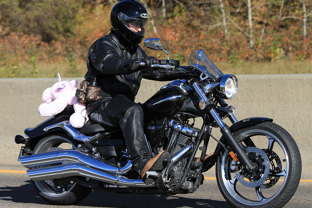

# Women Wearing Lipstick: Measuring the Bias Between an Object and Its Related Gender


 
  

  


## Overview 
In this paper, we investigate the impact of objects on gender bias in image captioning systems. Our results show that only gender-specific objects have a strong gender bias (_e.g._ <em>woman-lipstick</em>). In addition, 
      we propose a visual semantic-based gender score that measures the degree of bias and can be used as a plug-in for any image captioning system. Our experiments demonstrate the utility of the gender score, since 
      we observe that our score can measure the bias relation between a caption and its related gender; therefore, our score can be used as an additional metric to the existing Object Gender Co-Occ approach. 
  

 
 
 This repository contains the  implementation of the paper  [Women Wearing Lipstick: Measuring the Bias Between an Object and Its Related Gender](https://arxiv.org/abs/2310.19130). EMNLP Findings 2023
 
 [](https://arxiv.org/abs/2310.19130) [](https://ahmed.jp/project_page/gender_score_2023/index.html)
 


 ## Quick Start 
For a quick start please have a look at this [project page](https://ahmed.jp/project_page/gender_score_2023/index.html) 
and [demo](https://huggingface.co/spaces/AhmedSSabir/Demo-for-Gender-Score), 

<!-- [huggingface demo (EN)](https://huggingface.co) --> 
 <!-- , and [huggingface demo (JP)](https://huggingface.co) -->

[](https://github.com/ahmedssabir/GenderScore/tree/main/paper_demo)


### Requirements
- Python 3.7
- sentence_transformers 2.2.2

```
conda create -n gender_score python=3.7 anaconda
conda activate gender_score
pip install -U sentence-transformers 
``` 


 ## Gender Score  
In this work, we proposed two object-to-gender bias scores: (1) a direct Gender Score, and (2) a [ MASK ] based Gender Score Estimation. For the direct score, the model uses the visual context to predict the degree of related gender-object bias. we expain this next Example.

To run the Gender Score

```
python model_GS.py
```
using any pre-trained models as follows:
```
parser.add_argument('--vis', default='visual-context_label.txt',help='class-label from the classifier (CLIP)', type=str, required=True)  
parser.add_argument('--vis_prob', default='visual-context.txt', help='prob from the classifier (Resent152/CLIP)', type=str, required=True) 
parser.add_argument('--c',  default='caption.txt', help='caption from the baseline (any)', type=str, required=True) 
parser.add_argument('--GPT2model', default="gpt2", help='gpt2, gpt2-medium, gpt2-large, gpt2-xl, distilgpt2', type=str, required=False)  
parser.add_argument('--BERTmodel', default='roberta-large-nli-stsb-mean-tokens', help='all-mpnet-base-v2, multi-qa-mpnet-base-dot-v1, all-distilroberta-v1', type=str, required=False) 
```


To run Gender Score (_e.g._ man-motorcycle) we need three inputs: (1) caption, (2) object information ( _i.e._ visual bias)  and (3) confident of the bias object in the image.  


input

```
Caption: a man sitting on a blue motorcycle in a parking lot
visual context: motor scooter
visual context prob: 0.222983188
``` 
 ```
python model_GS.py --GPT2model gpt2  --BERTmodel roberta-large-nli-stsb-mean-tokens --vis  man_motorcycle_GS/visual_context_demo_motorcycle.txt --vis_prob  man_motorcycle_GS/visual_context_prob_demo_motorcycle.txt --c man_motorcycle_GS/caption_demo_motorcycle_MASK.txt
```
<!-- python model_GS.py --GPT2model gpt2  --BERTmodel roberta-large-nli-stsb-mean-tokens --vis  man_motorcycle_GS/man_motorcycle_visual_context.txt --vis_prob  man_motorcycle_GS/man_motorcycle_visual_context_prob.txt --c man_motorcycle_GS/man_motorcycle_caption.txt -->

output
```
a man sitting on a blue motorcycle in a parking lot, gender_score: 0.3145708898422527
```
<!--
 ```
 python model.py  --vis motorcycle_gender_demo/man_motorcycle/man_motorcycle_visual_context.txt --vis_prob motorcycle_gender_demo/man_motorcycle/man_motorcycle_visual_context_prob.txt --c motorcycle_gender_demo/man_motorcycle/man_motorcycle.txt --output result.txt
 ```
 -->
 
 ## Gender Score Estimation  
 Additionally, inspired by the Mask Language Model, the model can estimate the Mask gender using the relation between the caption and object information from the image. 

 <!-- 
 
 python model_GE.py --GPT2model distilgpt2  --BERTmodel stsb-distilbert-base --vis  man_motorcycle_GE/visual_context_demo_motorcycle.txt --vis_prob  man_motorcycle_GE/visual_context_prob_demo_motorcycle.txt --c man_motorcycle_GE/caption_demo_motorcycle_MASK.txt
 -->
 **Example**




input
```
Caption: a [MASK] riding a motorcycle on a road
visual context: motor scooter
visual context prob: 0.2183
```
To extract the visual context, please refer to this [page](https://github.com/ahmedssabir/Belief-Revision-Score/tree/main/model/Resent-152)

```
python model_GE.py --GPT2model gpt2  --BERTmodel roberta-large-nli-stsb-mean-tokens --vis  man_motorcycle_GE/visual_context_demo_motorcycle.txt --vis_prob  man_motorcycle_GE/visual_context_prob_demo_motorcycle.txt --c man_motorcycle_GE/caption_demo_motorcycle_MASK.txt
```

output
```
# object-to-m bias 
caption_m a man riding a motorcycle on a road
LM: 0.12759140133857727
cosine distance score (sim): 0.5452305674552917
gender score_m: 0.45320714150193153

# object-to-w bias 
caption_w a woman riding a motorcycle on a road
LM: 0.11249390989542007
cosine distance score (sim): 0.5037289261817932
gender score_w: 0.39912252800731546

# most object-to-gender bias 
object_gender_caption: a man riding a motorcycle on a road
ratio_to_m: 53.17275201306536
ratio_to_w: 46.82724798693463
```


##  Cloze gender to caption

In this section, we hypothesize that every image has a gender ∈ {man, woman} or gender-neutral _person_, and we want to explore all the cases and let the proposed distance/score **decide** which gender (_i.e. bias_) is in the image based on a **visual bias** from the caption. In particular, inspired by the cloze probability last word completion task, we generate two identical sentences but with a different gender, and then we compute the Gender Score between the sentence gender and the caption using the object probability(_i.e._ object confidence in the image). 


 **Example**

<!--  -->


```
python model_GS_cloze_gen.py  --GPT2model gpt2  --BERTmodel roberta-large-nli-stsb-mean-tokens --vis  GS-cloze-gender_demo/visual_context_demo.txt --vis_prob  GS-cloze-gender_demo/visual_context_prob_demo.txt --c GS-cloze-gender_demo/caption_demo.txt
 ```

<!-- Gender Score output on this BLIP baseline without gender in the image ```COCO_val2014_000000000042.jpg: a dog laying on top of a pile of shoes``` --> 
Gender Score output on a generated caption from the most recent baseline (BLIP-2)  without gender in the image ```COCO_val2014_000000066568.jpg: two teddy bears sitting next to each other on a desk``` with  object confidence _0.9_ with class lable _teddy bears_ in the image.


```
gender score m: 0.31807795162729513
gender score w: 0.3182200321892468
```

## Gender Score for non-visual task: gender bias in twitter 
In this section, we apply our proposed gender score to a subset of the Twitter user gender classification dataset. We use a BERT based keyword extractor  to extract the biased context from the sentence (_e.g._ travel-man, woman-family), and we then employ  the cloze probability to extract the probability of the context. We observe  that there are some keywords that have a strong  bias: women are associated with keywords such as _novel_, _beauty_ and _hometown_. Meanwhile, men are  more frequently related to words such as _gaming_, _coffee_ and _inspiration_.  


First we extract the context from each sentence with associate probability (_i.e._ tweet). We use [KeyBERT](https://github.com/MaartenGr/KeyBERT).

<!-- <a href="https://github.com/ahmedssabir/Belief-Revision-Score">Belief-Revision-Score</a> --> 

1- [Cloze prob based Context](https://github.com/ahmedssabir/GenderScore/blob/main/paper_demo/gender_score_twitter_demo.ipynb)

2- Context based probability 
```
from keybert import KeyBERT

sentence = “Blood makes you related. Loyalty makes you family”

kw_model = KeyBERT()
kw_model.extract_keywords(sentence, keyphrase_ngram_range=(1, 1), stop_words=None)

Keywords
[('loyalty', 0.5631), top-k
 ('blood', 0.5612),
 ('family', 0.4476),..]

Also, the average of all contexts can be used:

Top-3 average bias_context_prob = 0.5239 
``` 

```
python GS_cloze_prob.py --sent GS_twitter_demo/sentence.txt --context_prob GS_twitter_demo/bias_context_prob.txt
```
<!-- python GS_cloze_prob.py --sent GS_twitter_demo/sentence.txt --context_prob GS_twitter_demo/ave_bias_context_prob.txt -->

```
gender score m: 0.0024223817787602246
gender score w: 0.005365207900075213
sentence: blood makes you related. Loyalty makes you family. [predicted bias-gender: w]
GT: m
```

The GS can be adapted for other languages (_e.g._ tweet or short text). Therefore, We also [adopt this score](GS_twitter_demo_jp) to the **Japanese language**. <!-- Please refer to this demo for fast start [huggingface demo (JP)](https://huggingface.co) -->


## Citation


The details of this repo are described in the following paper. If you find this repo useful, please kindly cite it:

```bibtex
@article{sabir2023women,
  title={Women Wearing Lipstick: Measuring the Bias Between an Object and Its Related Gender},
  author={Sabir, Ahmed and Padr{\'o}, Llu{\'\i}s},
  journal={arXiv preprint arXiv:2310.19130},
  year={2023}
}
```


<!-- <a href="https://github.com/ahmedssabir/Belief-Revision-Score">Belief-Revision-Score</a> --> 
 ### Acknowledgement
The implementation of the Gender Score relies on resources from <a href="https://github.com/simonepri/lm-scorer">lm-score</a>, <a href="https://github.com/huggingface/transformers">Huggingface Transformers</a>, and <a href="https://www.sbert.net/">SBERT</a>. We thank the original authors for their well organized codebase.
